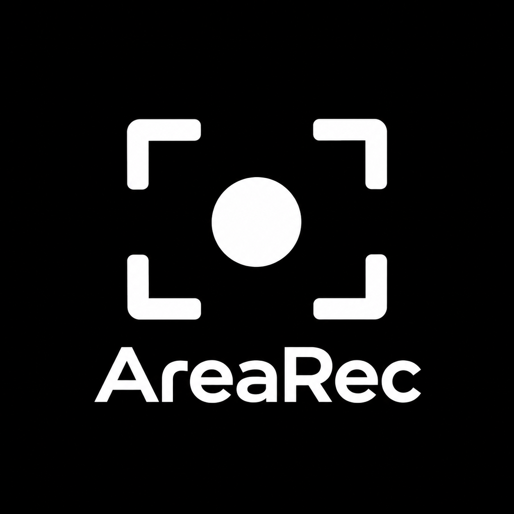
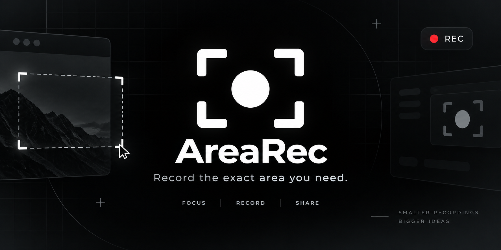

<p align="center">
  <br>
  <strong>AreaRec</strong>
</p>

<p align="center">
  <em>Select a region. Record it. Get an MP4.</em>
</p>

<p align="center">
  
</p>

AreaRec is a tiny, local-first Windows screen recorder focused on one workflow: drag a rectangle over the screen and record exactly that area. No account, no cloud, no telemetry, no editor.

The native Windows implementation lives in the `AreaRec.sln` solution and is
the only supported product path.

## Why AreaRec?

Most screen-recording tools are built as full production suites. AreaRec deliberately is not. Its v0.1 scope is frozen around the shortest useful path:

`Select region → Record → Stop → MP4`

## Features

- Mouse-driven region selection
- Exact X/Y/width/height capture
- 30 or 60 FPS
- Optional mouse cursor
- MP4/H.264 output through Windows Media Foundation
- Windows Graphics Capture with DXGI Desktop Duplication fallback
- Direct3D 11 crop/readback pipeline
- Ctrl+Shift+R global hotkey and tray lifecycle
- Versioned local JSON settings for FPS, quality, cursor and save folder
- Zero network requirement at runtime
- No Python or FFmpeg runtime dependency for the native app

## Requirements

- Windows 10/11
- .NET 8 SDK for development, or use the self-contained Windows x64 publish
- Windows 10/11 x64 with Media Foundation and Direct3D 11

## Run

```powershell
dotnet run --project src/AreaRec.App/AreaRec.App.csproj
```

Create a self-contained portable build:

```powershell
.\PUBLISH_PORTABLE.ps1
```

The script creates `artifacts/AreaRec-win-x64.zip` and a SHA-256 sidecar.

## Design constraints

AreaRec intentionally does not include system audio, microphone recording, video
editing, webcam or annotations. Multi-monitor composition is implemented but
still requires runtime verification on mixed-DPI hardware. See
[docs/NATIVE_MIGRATION.md](docs/NATIVE_MIGRATION.md) and
[docs/VERIFICATION.md](docs/VERIFICATION.md) for migration status and evidence.

## Privacy

AreaRec does not make network requests. Captures are written directly to the path chosen by the user.

## License

AreaRec source code is MIT licensed. The native path uses Windows APIs and the
.NET runtime only; see [THIRD_PARTY.md](THIRD_PARTY.md) for the current
dependency inventory.
